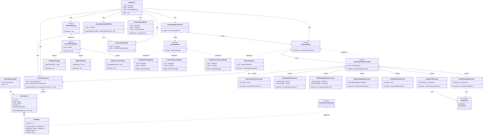

## Class Diagram

```mermaid
classDiagram
    direction TB

%% ===== Domain : Inventory =====

    class IComparable~StarRating~ {
        <<interface>>
    }

    class StarRating {
        + StarValue : int
        + CompareTo(other : StarRating)  int
        + Equals(obj : object)  override bool
        + GetHashCode() int
        +ToString() string
    }

    class InventoryItem {
        + Id : Guid
        + Name : string
        + Price : decimal
        + Quantity : int
        + StarRating StarRating
        + ReduceQuantity(amount : int) void

    }

    class InventoryRepository {
        - _items : List~InventoryItem~
        + Items : IReadOnlyList~InventoryItem~
        + UpdateQuantity(id : Guid, quantityPurchased : int) void
    }

%% ===== Domain : InventoryQuery =====

    class QueriedInventoryItem {
        + Item : InventoryItem
        + Index : int
    }

    class IInventoryQuery {
        <<interface>>
        + Execute() List~QueriedInventoryItem~
    }

    class AllInventoryQuery {
        + Execute() List~QueriedInventoryItem~
        - _stock : InventoryRepository
    }

%% ===== Decorator Classes =====

    class InventoryQueryDecoratorBase {
        <<abstract>>
        # _inner : IInventoryQuery
        + Execute() List~QueriedInventoryItem~
    }

    class NameContainsFilterDecorator {
        - _searchText : string
        + Execute() List~QueriedInventoryItem~
    }

    class PriceRangeFilterDecorator {
        - _searchPriceMin : decimal
        - _searchPriceMax : decimal
        + Execute() List~QueriedInventoryItem~
    }

    class StarRatingRangeFilterDecorator {
        - _searchRangeMin : StarRating
        - _searchRangeMax : StarRating
        + Execute() List~QueriedInventoryItem~
    }

    class MinStarRatingFilterDecorator {
        - _searchMinStarRating : StarRating
        + Execute() List~QueriedInventoryItem~
    }

    class AvailabilityFilterDecorator {
        - _isAvailable : bool
        + Execute() List~QueriedInventoryItem~
    }

%% ===== Sort By =====

    class SortDirection {
        <<enumeration>>
        ASCENDING
        DESCENDING
    }

    class SortByStarRatingDecorator {
        - _starDirection : SortDirection
        + Execute() List~QueriedInventoryItem~
    }

    class SortByPriceDecorator {
        - _priceDirection : SortDirection
        + Execute() List~QueriedInventoryItem~

    }

%% ===== Domain : Payment =====

    class IPaymentStrategy {
        <<interface>>
        + Checkout() void
    }

    class PaymentStrategyBase {
        <<abstract>>
        # _price : decimal
        + Checkout() void
    }

    class CreditCardStrategy {
        - _creditCardNumber : string
        + Checkout() void
    }

    class ApplePayStrategy {
        - _phoneNumber : string
        + Checkout() void
    }

    class CryptoCurrencyStrategy {
        - _cryptoWalletNumber : string
        + Checkout() void
    }


%% ===== User Interface =====


    class Application {
        - _input : TextReader
        - _output : TextWriter
        - _stock : InventoryRepository
        + Run() void
    }

%% ===== Query Builder =====

    class IPaymentBuilder {
        <<interface>>
        + Build() : IPaymentStrategy
    }

    class InventoryQueryBuilder {
        - _input : TextReader
        - _output : TextWriter
        - _stock : InventoryRepository
        + BuildQuery() IInventoryQuery
    }

    class InventoryQueryOutput {
        + Filters : List~string~
        + Items : List~QueriedInventoryItem~
    }

    class InventoryQueryOutputWriter {
        - _output : TextWriter
        + WriteOutput(queryOutput : InventoryQueryOutput) void
    }

%% ===== Payment Builder =====

    class PaymentBuilderListFactory {
        +Create() List~IPaymentBuilder~
    }

    class ApplePayPaymentBuilder {
        - _input : TextReader
        - _output : TextWriter
        + Build() IPaymentStrategy
    }

    class CreditCardPaymentBuilder {
        - _input : TextReader
        - _output : TextWriter
        + Build() IPaymentStrategy
    }

    class CryptoCurrencyPaymentBuilder {
        - _input : TextReader
        - _output : TextWriter
        + Build() IPaymentStrategy
    }

    IComparable~StarRating~ <|.. StarRating : implements
    InventoryRepository *-- InventoryItem : contains
    InventoryItem *-- StarRating : has

    QueriedInventoryItem --> InventoryItem : uses
    IInventoryQuery <|.. AllInventoryQuery : implements
    AllInventoryQuery --> InventoryRepository : uses

    IInventoryQuery <|.. InventoryQueryDecoratorBase : implements
    InventoryQueryDecoratorBase --> IInventoryQuery : wraps


    InventoryQueryDecoratorBase <|-- NameContainsFilterDecorator :extends
    InventoryQueryDecoratorBase <|-- PriceRangeFilterDecorator :extends
    InventoryQueryDecoratorBase <|-- StarRatingRangeFilterDecorator :extends
    InventoryQueryDecoratorBase <|-- MinStarRatingFilterDecorator :extends
    InventoryQueryDecoratorBase <|-- AvailabilityFilterDecorator :extends


    SortByStarRatingDecorator --> SortDirection : uses
    InventoryQueryDecoratorBase <|-- SortByStarRatingDecorator :extends

    SortByPriceDecorator --> SortDirection : uses
    InventoryQueryDecoratorBase <|-- SortByPriceDecorator :extends

    IPaymentStrategy <|.. PaymentStrategyBase : implements
    PaymentStrategyBase <|-- CreditCardStrategy :extends
    PaymentStrategyBase <|-- CryptoCurrencyStrategy :extends
    PaymentStrategyBase <|-- ApplePayStrategy : extends

    Application --> InventoryQueryBuilder : uses
    Application --> InventoryQueryOutput : uses
    Application --> InventoryQueryOutputWriter : uses
    Application --> InventoryRepository : uses
    Application --> IInventoryQuery : uses
    Application --> IPaymentStrategy : uses
    Application --> PaymentBuilderListFactory : uses

    InventoryQueryBuilder --> InventoryRepository : uses
    InventoryQueryBuilder --> IInventoryQuery :creates

    PaymentBuilderListFactory --> IPaymentBuilder : creates
    InventoryQueryOutputWriter --> InventoryQueryOutput : uses

    IPaymentBuilder <|.. ApplePayPaymentBuilder : implements
    IPaymentBuilder <|.. CreditCardPaymentBuilder : implements
    IPaymentBuilder <|.. CryptoCurrencyPaymentBuilder : implements
```