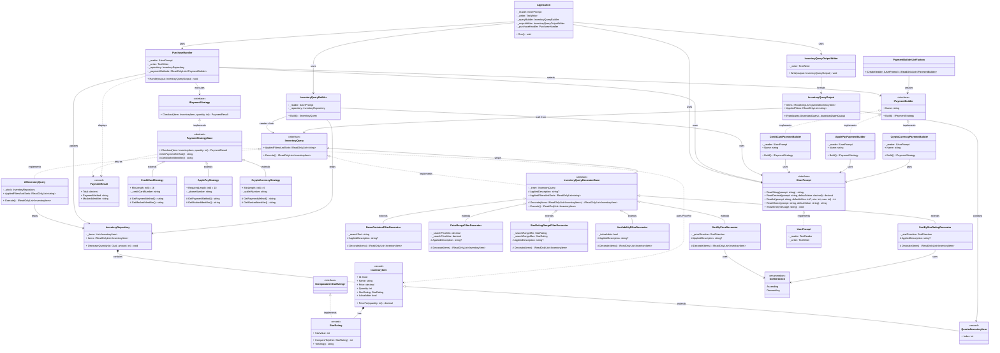

## Class Diagram

```mermaid
classDiagram
    direction TB

%% ===== Domain : Inventory =====

    class IComparable~StarRating~ {
        <<interface>>
    }

    class StarRating {
        <<record>>
        + StarValue: int
        + CompareTo(other: StarRating) int
        + ToString() string
    }

    class InventoryItem {
        <<record>>
        + Id: Guid
        + Name: string
        + Price: decimal
        + Quantity: int
        + StarRating: StarRating
        + IsAvailable: bool
        + PriceFor(quantity: int) decimal
    }

    class InventoryRepository {
        - _items: List~InventoryItem~
        + Items: IReadOnlyList~InventoryItem~
        + DecreaseQuantity(id: Guid, amount: int) void
    }

%% ===== Domain : InventoryQuery =====

    class QueriedInventoryItem {
        <<record>>
        + Index: int
    }

    class IInventoryQuery {
        <<interface>>
        + Execute() IReadOnlyList~InventoryItem~
        + AppliedFiltersAndSorts: IReadOnlyList~string~
    }

    class AllInventoryQuery {
        - _stock: InventoryRepository
        + Execute() IReadOnlyList~InventoryItem~
        + AppliedFiltersAndSorts: IReadOnlyList~string~
    }

%% ===== Decorator Base =====

    class InventoryQueryDecoratorBase {
        <<abstract>>
        - _inner: IInventoryQuery
        # AppliedDescription: string?
        # Decorate(items: IReadOnlyList~InventoryItem~)* IReadOnlyList~InventoryItem~
        + Execute() IReadOnlyList~InventoryItem~
        + AppliedFiltersAndSorts: IReadOnlyList~string~
    }

%% ===== Filters =====

    class NameContainsFilterDecorator {
        - _searchText: string
        # AppliedDescription: string?
        # Decorate(items) IReadOnlyList~InventoryItem~
    }

    class PriceRangeFilterDecorator {
        - _searchPriceMin: decimal
        - _searchPriceMax: decimal
        # AppliedDescription: string?
        # Decorate(items) IReadOnlyList~InventoryItem~
    }

    class StarRatingRangeFilterDecorator {
        - _searchRangeMin: StarRating
        - _searchRangeMax: StarRating
        # AppliedDescription: string?
        # Decorate(items) IReadOnlyList~InventoryItem~
    }

    class AvailabilityFilterDecorator {
        - _isAvailable: bool
        # AppliedDescription: string?
        # Decorate(items) IReadOnlyList~InventoryItem~
    }

%% ===== Sorts =====

    class SortDirection {
        <<enumeration>>
        Ascending
        Descending
    }

    class SortByStarRatingDecorator {
        - _starDirection: SortDirection
        # AppliedDescription: string?
        # Decorate(items) IReadOnlyList~InventoryItem~
    }

    class SortByPriceDecorator {
        - _priceDirection: SortDirection
        # AppliedDescription: string?
        # Decorate(items) IReadOnlyList~InventoryItem~
    }

%% ===== Domain : Payment =====

    class PaymentResult {
        <<record>>
        + Total: decimal
        + PaymentMethod: string
        + MaskedIdentifier: string
    }

    class IPaymentStrategy {
        <<interface>>
        + Checkout(item: InventoryItem, quantity: int) PaymentResult
    }

    class PaymentStrategyBase {
        <<abstract>>
        + Checkout(item: InventoryItem, quantity: int) PaymentResult
        # GetPaymentMethod()* string
        # GetMaskedIdentifier()* string
    }

    class CreditCardStrategy {
        + MinLength: int$ = 16
        - _creditCardNumber: string
        # GetPaymentMethod() string
        # GetMaskedIdentifier() string
    }

    class ApplePayStrategy {
        + RequiredLength: int$ = 10
        - _phoneNumber: string
        # GetPaymentMethod() string
        # GetMaskedIdentifier() string
    }

    class CryptoCurrencyStrategy {
        + MinLength: int$ = 6
        - _walletNumber: string
        # GetPaymentMethod() string
        # GetMaskedIdentifier() string
    }

%% ===== User Interface =====

    class IUserPrompt {
        <<interface>>
        + ReadString(prompt: string) string
        + ReadDecimal(prompt: string, defaultValue: decimal) decimal
        + ReadInt(prompt: string, defaultValue: int?, min: int, max: int) int
        + ReadChoice(prompt: string, defaultValue: string) string
        + ShowError(message: string) void
    }

    class UserPrompt {
        - _reader: TextReader
        - _writer: TextWriter
    }

    class Application {
        - _reader: IUserPrompt
        - _writer: TextWriter
        - _queryBuilder: InventoryQueryBuilder
        - _outputWriter: InventoryQueryOutputWriter
        - _purchaseHandler: PurchaseHandler
        + Run() void
    }

    class PurchaseHandler {
        - _reader: IUserPrompt
        - _writer: TextWriter
        - _repository: InventoryRepository
        - _paymentMethods: IReadOnlyList~IPaymentBuilder~
        + Handle(output: InventoryQueryOutput) void
    }

%% ===== Query Builder =====

    class InventoryQueryBuilder {
        - _reader: IUserPrompt
        - _repository: InventoryRepository
        + Build() IInventoryQuery
    }

    class InventoryQueryOutput {
        + Items: IReadOnlyList~QueriedInventoryItem~
        + AppliedFilters: IReadOnlyList~string~
        + From(query: IInventoryQuery)$ InventoryQueryOutput
    }

    class InventoryQueryOutputWriter {
        - _writer: TextWriter
        + Write(output: InventoryQueryOutput) void
    }

%% ===== Payment Builder =====

    class IPaymentBuilder {
        <<interface>>
        + Name: string
        + Build() IPaymentStrategy
    }

    class PaymentBuilderListFactory {
        + Create(reader: IUserPrompt)$ IReadOnlyList~IPaymentBuilder~
    }

    class CreditCardPaymentBuilder {
        - _reader: IUserPrompt
        + Name: string
        + Build() IPaymentStrategy
    }

    class ApplePayPaymentBuilder {
        - _reader: IUserPrompt
        + Name: string
        + Build() IPaymentStrategy
    }

    class CryptoCurrencyPaymentBuilder {
        - _reader: IUserPrompt
        + Name: string
        + Build() IPaymentStrategy
    }

%% ===== Relationships =====

%% Inventory
    IComparable~StarRating~ <|.. StarRating : implements
    InventoryItem *-- StarRating : has
    InventoryItem <|-- QueriedInventoryItem : extends
    InventoryRepository *-- InventoryItem : contains

%% Query chain
    IInventoryQuery <|.. AllInventoryQuery : implements
    IInventoryQuery <|.. InventoryQueryDecoratorBase : implements
    AllInventoryQuery --> InventoryRepository : reads
    InventoryQueryDecoratorBase --> IInventoryQuery : wraps

%% Filters
    InventoryQueryDecoratorBase <|-- NameContainsFilterDecorator : extends
    InventoryQueryDecoratorBase <|-- PriceRangeFilterDecorator : extends
    InventoryQueryDecoratorBase <|-- StarRatingRangeFilterDecorator : extends
    InventoryQueryDecoratorBase <|-- AvailabilityFilterDecorator : extends

%% Sorts
    InventoryQueryDecoratorBase <|-- SortByPriceDecorator : extends
    InventoryQueryDecoratorBase <|-- SortByStarRatingDecorator : extends
    SortByPriceDecorator --> SortDirection : uses
    SortByStarRatingDecorator --> SortDirection : uses

%% Payment domain
    IPaymentStrategy <|.. PaymentStrategyBase : implements
    PaymentStrategyBase <|-- CreditCardStrategy : extends
    PaymentStrategyBase <|-- ApplePayStrategy : extends
    PaymentStrategyBase <|-- CryptoCurrencyStrategy : extends
    PaymentStrategyBase ..> PaymentResult : returns
    PaymentStrategyBase ..> InventoryItem : uses PriceFor

%% IUserPrompt
    IUserPrompt <|.. UserPrompt : implements

%% Application layer
    Application --> IUserPrompt : uses
    Application --> InventoryQueryBuilder : uses
    Application --> InventoryQueryOutputWriter : uses
    Application --> PurchaseHandler : uses

%% PurchaseHandler
    PurchaseHandler --> IUserPrompt : uses
    PurchaseHandler --> InventoryRepository : updates
    PurchaseHandler --> IPaymentBuilder : selects
    PurchaseHandler --> IPaymentStrategy : executes
    PurchaseHandler ..> PaymentResult : displays

%% Query builder
    InventoryQueryBuilder --> IUserPrompt : uses
    InventoryQueryBuilder --> InventoryRepository : reads
    InventoryQueryBuilder --> IInventoryQuery : creates chain
    InventoryQueryOutput --> QueriedInventoryItem : contains
    InventoryQueryOutput --> IInventoryQuery : built from
    InventoryQueryOutputWriter --> InventoryQueryOutput : formats

%% Payment builders
    PaymentBuilderListFactory --> IPaymentBuilder : creates
    IPaymentBuilder <|.. CreditCardPaymentBuilder : implements
    IPaymentBuilder <|.. ApplePayPaymentBuilder : implements
    IPaymentBuilder <|.. CryptoCurrencyPaymentBuilder : implements
    CreditCardPaymentBuilder --> IUserPrompt : uses
    ApplePayPaymentBuilder --> IUserPrompt : uses
    CryptoCurrencyPaymentBuilder --> IUserPrompt : uses

```