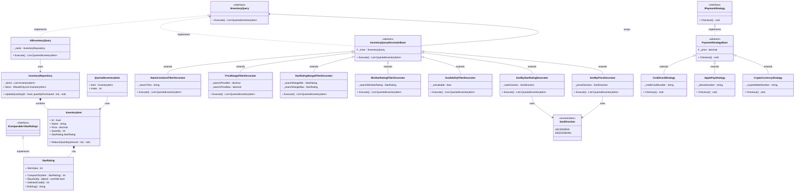

## Class Diagram

```mermaid
classDiagram
    direction TB
    
    %% ===== Domain : Inventory =====
    
    class IComparable~StarRating~ {
        <<interface>>
    }
    
    class StarRating {
        + StarValue : int
        + CompareTo(other : StarRating)  int
        + Equals(obj : object)  override bool
        + GetHashCode() int
        +ToString() string
    }
    
    class InventoryItem {
        + Id : Guid
        + Name : string
        + Price : decimal
        + Quantity : int
        + StarRating StarRating
        + ReduceQuantity(amount : int) void
        
    }
    
    class InventoryRepository {
        - _items : List~InventoryItem~
        + Items : IReadOnlyList~InventoryItem~
        + UpdateQuantity(id : Guid, quantityPurchased : int) void
    }
    
    %% ===== Domain : InventoryQuery =====
    
    class QueriedInventoryItem {
        + Item : InventoryItem
        + Index : int
    }
    
    class IInventoryQuery {
        <<interface>>
        + Execute() List~QueriedInventoryItem~
    }
    
    class AllInventoryQuery {
        + Execute() List~QueriedInventoryItem~
        - _stock : InventoryRepository
    }
    
    %% ===== Decorator Classes =====
    
    class InventoryQueryDecoratorBase {
        <<abstract>>
        # _inner : IInventoryQuery
        + Execute() List~QueriedInventoryItem~
    }
    
    class NameContainsFilterDecorator {
        - _searchText : string
        + Execute() List~QueriedInventoryItem~
    }

    class PriceRangeFilterDecorator {
        - _searchPriceMin : decimal
        - _searchPriceMax : decimal
        + Execute() List~QueriedInventoryItem~
    }

    class StarRatingRangeFilterDecorator {
        - _searchRangeMin : StarRating
        - _searchRangeMax : StarRating
        + Execute() List~QueriedInventoryItem~
    }
    
    class MinStarRatingFilterDecorator {
        - _searchMinStarRating : StarRating
        + Execute() List~QueriedInventoryItem~
    }

    class AvailabilityFilterDecorator {
        - _isAvailable : bool
        + Execute() List~QueriedInventoryItem~
    }
    
    %% ===== Sort By =====
    
    class SortDirection {
        <<enumeration>>
        ASCENDING
        DESCENDING
    }
    
    class SortByStarRatingDecorator {
        - _starDirection : SortDirection
        + Execute() List~QueriedInventoryItem~
    }
    
    class SortByPriceDecorator {
        - _priceDirection : SortDirection
        + Execute() List~QueriedInventoryItem~
        
    }
    
    %% ===== Domain : Payment =====
    
    class IPaymentStrategy {
        <<interface>>
        + Checkout() void
    }
    
    class PaymentStrategyBase {
        <<abstract>>
        # _price : decimal
        + Checkout() void
    }
    
    class CreditCardStrategy {
        - _creditCardNumber : string
        + Checkout() void
    }

    class ApplePayStrategy {
        - _phoneNumber : string
        + Checkout() void
    }
    
    class CryptoCurrencyStrategy {
        - _cryptoWalletNumber : string
        + Checkout() void
    }
    
    
    
    IComparable~StarRating~ <|.. StarRating : implements
    InventoryRepository *-- InventoryItem : contains
    InventoryItem *-- StarRating : has
    
    QueriedInventoryItem --> InventoryItem : uses
    IInventoryQuery <|.. AllInventoryQuery : implements
    AllInventoryQuery --> InventoryRepository : uses

    IInventoryQuery <.. InventoryQueryDecoratorBase : implements
    InventoryQueryDecoratorBase --> IInventoryQuery : wraps
    
    
    InventoryQueryDecoratorBase <|-- NameContainsFilterDecorator :extends

    InventoryQueryDecoratorBase <|-- PriceRangeFilterDecorator :extends

    InventoryQueryDecoratorBase <|-- StarRatingRangeFilterDecorator :extends

    InventoryQueryDecoratorBase <|-- MinStarRatingFilterDecorator :extends

    InventoryQueryDecoratorBase <|-- AvailabilityFilterDecorator :extends
    
    
    SortByStarRatingDecorator --> SortDirection : uses
    InventoryQueryDecoratorBase <|-- SortByStarRatingDecorator :extends
    
    SortByPriceDecorator --> SortDirection : uses
    InventoryQueryDecoratorBase <|-- SortByPriceDecorator :extends
    
    IPaymentStrategy <|.. PaymentStrategyBase : implements
    PaymentStrategyBase <|-- CreditCardStrategy :extends
    PaymentStrategyBase <|-- CryptoCurrencyStrategy :extends
    PaymentStrategyBase <|-- ApplePayStrategy :extends
```